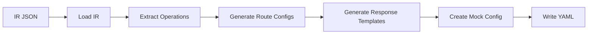

# Mock Config Builder

> Generate mock server configurations from OpenAPI intermediate representation

## Overview

The Mock Config Builder transforms normalized OpenAPI specifications (IR JSON) into mock server configuration files. These configurations define routes, response templates, and server settings for the FastAPI-based mock server runtime.

## Features

- ✅ **Automatic Configuration Generation**: Creates mock configs from IR JSON
- ✅ **Response Templates**: Pre-populated with example responses
- ✅ **Port Management**: Configurable port assignments per service
- ✅ **YAML Output**: Human-readable configuration format
- ✅ **Version-aware**: Organized by service and version

## Installation

```bash
# Install all dependencies
uv sync

# Install development dependencies
uv sync --group dev
```

## Usage

### Basic Usage

```bash
# Generate mock configuration from IR
uv run python apps/mock-config-builder/mock_config_builder/main.py \
    --ir workspace/catalog/payments-api/1.0.0.json \
    --output-dir artifacts/mocks
```

### With Custom Port

```bash
# Specify custom port for mock server
uv run python apps/mock-config-builder/mock_config_builder/main.py \
    --ir workspace/catalog/payments-api/1.0.0.json \
    --output-dir artifacts/mocks \
    --port rest=9101
```

### Command-Line Options

| Option | Required | Default | Description |
|--------|----------|---------|-------------|
| `--ir` | Yes | - | Path to IR JSON file from contract parser |
| `--output-dir` | Yes | - | Output directory for mock configurations |
| `--port` | No | `rest=9100` | Port assignment (format: `protocol=port`) |
| `--host` | No | `localhost` | Bind address for mock server |
| `--log-level` | No | `INFO` | Logging level (DEBUG, INFO, WARNING, ERROR) |

### Environment Variables

```bash
# Control output format
$env:CONSOLE_OUTPUT_FORMAT = "rich"  # rich, plain, json, auto

# Set logging level
$env:LOG_LEVEL = "DEBUG"
```

## Output Structure

### Directory Layout

```
artifacts/mocks/
  payments-api/
    1-0-0/                      # Version with hyphens
      mock-config.yaml          # Mock server configuration
  commerce-operations-api/
    1-1-0/
      mock-config.yaml
```

### Configuration Format

```yaml
# mock-config.yaml
service: payments-api
version: 1.0.0
port: 9101
host: localhost

routes:
  - path: /payments
    method: POST
    operation_id: createPayment
    description: Create a new payment
    response:
      status: 200
      headers:
        Content-Type: application/json
      body:
        paymentId: mock-12345
        status: completed
        amount: 100.50
        currency: USD
        createdAt: '2026-01-12T12:00:00Z'
  
  - path: /payments/{paymentId}
    method: GET
    operation_id: getPayment
    description: Retrieve payment details
    response:
      status: 200
      headers:
        Content-Type: application/json
      body:
        paymentId: '{paymentId}'
        status: completed
        amount: 100.50
        currency: USD
  
  - path: /payments
    method: GET
    operation_id: listPayments
    description: List all payments
    response:
      status: 200
      headers:
        Content-Type: application/json
      body:
        payments:
          - paymentId: mock-001
            status: completed
            amount: 50.00
          - paymentId: mock-002
            status: pending
            amount: 75.50
        total: 2
```

## Architecture

### Core Components

```
mock_config_builder/
  __init__.py
  main.py              # CLI entry point
  generator.py         # Configuration generation logic
  models.py            # Pydantic data models
  templates.py         # Response template generation
```

### Data Flow



### Configuration Generation Process

1. **Load IR**: Parse intermediate representation JSON
2. **Extract Operations**: Identify all API operations
3. **Generate Routes**: Create route configurations for each operation
4. **Generate Templates**: Create response templates with example values
5. **Assemble Config**: Combine routes into mock server configuration
6. **Write YAML**: Save configuration file

## Implementation Details

### Route Configuration

Routes are generated from OpenAPI operations:

```python
def generate_route_config(operation):
    """Generate route configuration from operation"""
    return {
        "path": operation["path"],
        "method": operation["method"],
        "operation_id": operation["operationId"],
        "description": operation.get("summary", ""),
        "response": generate_response_template(operation)
    }
```

### Response Template Generation

Response templates are created from OpenAPI response schemas:

```python
def generate_response_template(operation):
    """Generate response template from operation"""
    default_response = operation["responses"]["200"]
    
    return {
        "status": 200,
        "headers": {
            "Content-Type": "application/json"
        },
        "body": generate_example_from_schema(
            default_response["schema"]
        )
    }
```

### Example Value Generation

Example values follow these rules:

| Schema Type | Generated Value |
|-------------|-----------------|
| `string` | `"mock-value"` |
| `string (uuid)` | `"mock-uuid-123"` |
| `string (date-time)` | `"2026-01-12T12:00:00Z"` |
| `string (email)` | `"mock@example.com"` |
| `integer` | `42` |
| `number` | `123.45` |
| `boolean` | `true` |
| `array` | Array with one example item |
| `object` | Object with all properties |

Special handling:
- **Path parameters**: Use template variables (e.g., `{paymentId}`)
- **Enums**: Use first enum value
- **OpenAPI examples**: Use if provided in spec
- **Required fields**: Always included in response

## Examples

### Generate Mock Config for Payments API

```bash
# Parse contract first
uv run python apps/contract-parser/contract_parser/main.py \
    --spec specs/payments.yaml \
    --output-dir workspace/catalog

# Generate mock configuration
uv run python apps/mock-config-builder/mock_config_builder/main.py \
    --ir workspace/catalog/payments-api/1.0.0.json \
    --output-dir artifacts/mocks \
    --port rest=9101
```

**Output:**
```
✓ Loaded IR for payments-api v1.0.0
✓ Found 5 operations
✓ Generated 5 route configurations
✓ Created mock config at artifacts/mocks/payments-api/1-0-0/mock-config.yaml
```

### Generate Configs for Multiple Services

```powershell
# PowerShell script to generate configs for all services
$specs = @(
    @{spec="payments.yaml"; port=9101},
    @{spec="commerce.yaml"; port=9102},
    @{spec="flights.yaml"; port=9103}
)

foreach ($item in $specs) {
    Write-Host "Processing $($item.spec)..." -ForegroundColor Cyan
    
    # Parse
    uv run python apps/contract-parser/contract_parser/main.py `
        --spec "specs/$($item.spec)" `
        --output-dir workspace/catalog
    
    # Generate mock config
    $irFiles = Get-ChildItem -Path workspace/catalog -Recurse -Filter "*.json" | 
               Where-Object { $_.Name -ne "index.json" }
    
    foreach ($ir in $irFiles) {
        uv run python apps/mock-config-builder/mock_config_builder/main.py `
            --ir $ir.FullName `
            --output-dir artifacts/mocks `
            --port "rest=$($item.port)"
    }
}
```

### Custom Response Templates

```yaml
# custom-responses.yaml
# Override default response generation

custom_responses:
  createPayment:
    response:
      status: 201
      body:
        paymentId: "CUSTOM-{timestamp}"
        status: "processing"
        message: "Payment is being processed"
  
  listPayments:
    response:
      body:
        payments: []
        total: 0
        message: "No payments found"
```

Usage:
```bash
uv run python apps/mock-config-builder/mock_config_builder/main.py \
    --ir workspace/catalog/payments-api/1.0.0.json \
    --output-dir artifacts/mocks \
    --custom-responses custom-responses.yaml
```

## Integration with Pipeline

### Universal Pipeline

The mock-config-builder is automatically executed by the universal pipeline:

```powershell
# Automatic execution as part of pipeline
.\scripts\run-smoke-pipeline.ps1 -SpecPath "specs/payments.yaml" -MockPort 9101
```

Pipeline steps:
1. Parse contract → IR JSON
2. **Generate mock config** ← This component
3. Generate test scenarios
4. Start mock server (uses generated config)
5. Execute tests

### Manual Integration

```bash
# Step 1: Parse contract
uv run python apps/contract-parser/contract_parser/main.py \
    --spec specs/payments.yaml \
    --output-dir workspace/catalog

# Step 2: Generate mock config (this component)
uv run python apps/mock-config-builder/mock_config_builder/main.py \
    --ir workspace/catalog/payments-api/1.0.0.json \
    --output-dir artifacts/mocks \
    --port rest=9101

# Step 3: Start mock server
uv run python apps/mock-server/mock_server/main.py \
    --config artifacts/mocks/payments-api/1-0-0/mock-config.yaml
```

## Configuration Options

### Port Assignment

```bash
# Default port (9100)
--port rest=9100

# Custom port
--port rest=9101

# Multiple protocols (future)
--port rest=9101,grpc=50051
```

### Host Configuration

```bash
# Default (localhost)
--host localhost

# All interfaces
--host 0.0.0.0

# Specific IP
--host 192.168.1.100
```

### Advanced Configuration

Create an advanced config file for complex scenarios:

```yaml
# advanced-mock-config.yaml
service: payments-api
version: 1.0.0
port: 9101
host: localhost

settings:
  # Latency simulation
  latency:
    enabled: true
    min_ms: 50
    max_ms: 200
  
  # Rate limiting
  rate_limit:
    enabled: false
    requests_per_second: 100
  
  # CORS configuration
  cors:
    enabled: true
    origins: ["http://localhost:3000"]
  
  # Authentication
  auth:
    enabled: false
    type: bearer
    token: "mock-token-123"

routes:
  # Routes generated by builder
  # Can be manually edited for custom behavior
```

## Troubleshooting

### Issue: Missing Response Examples

**Problem:** Generated responses have minimal data

**Solution:** Add examples to OpenAPI spec:

```yaml
components:
  schemas:
    Payment:
      type: object
      properties:
        paymentId:
          type: string
          example: "PAY-12345"
        amount:
          type: number
          example: 100.50
      example:
        paymentId: "PAY-12345"
        amount: 100.50
        status: "completed"
```

### Issue: Port Already in Use

**Problem:** Mock server fails to start

**Solution:** Use a different port:

```bash
uv run python apps/mock-config-builder/mock_config_builder/main.py \
    --ir workspace/catalog/payments-api/1.0.0.json \
    --output-dir artifacts/mocks \
    --port rest=9102  # Use different port
```

### Issue: Invalid YAML Output

**Problem:** Generated YAML has syntax errors

**Solution:** Check IR JSON structure:

```bash
# Validate IR JSON
cat workspace/catalog/payments-api/1.0.0.json | jq '.'

# Re-parse with debug logging
uv run python apps/contract-parser/contract_parser/main.py \
    --spec specs/payments.yaml \
    --output-dir workspace/catalog \
    --log-level DEBUG
```

## Development

### Running Tests

```bash
# Run unit tests
uv run pytest apps/mock-config-builder/tests/

# With coverage
uv run pytest --cov=mock_config_builder apps/mock-config-builder/tests/
```

### Code Quality

```bash
# Format code
ruff format apps/mock-config-builder/

# Lint code
ruff check apps/mock-config-builder/

# Fix issues
ruff check --fix apps/mock-config-builder/
```

### Adding New Features

1. **Create feature branch**: `git checkout -b feature/my-feature`
2. **Implement feature**: Add code to appropriate module
3. **Add tests**: Create tests in `tests/` directory
4. **Update documentation**: Update this README
5. **Run quality checks**: `ruff format && ruff check`
6. **Submit PR**: Create pull request with description

## Mock Configuration Schema

### Complete YAML Schema

```yaml
# Complete mock-config.yaml schema
service: string                # Service name
version: string                # Service version
port: integer                  # Server port
host: string                   # Bind address

settings:                      # Optional settings
  latency:
    enabled: boolean
    min_ms: integer
    max_ms: integer
  rate_limit:
    enabled: boolean
    requests_per_second: integer
  cors:
    enabled: boolean
    origins: [string]
  auth:
    enabled: boolean
    type: string
    token: string

routes:                        # List of route configurations
  - path: string               # Endpoint path
    method: string             # HTTP method
    operation_id: string       # OpenAPI operation ID
    description: string        # Operation description
    response:
      status: integer          # HTTP status code
      headers:                 # Response headers
        key: value
      body:                    # Response body (any JSON)
        key: value
```

### Route Configuration Examples

```yaml
# Simple GET
- path: /health
  method: GET
  operation_id: healthCheck
  response:
    status: 200
    body:
      status: "healthy"

# POST with validation
- path: /payments
  method: POST
  operation_id: createPayment
  response:
    status: 201
    headers:
      Location: "/payments/mock-12345"
    body:
      paymentId: "mock-12345"
      status: "created"

# Path parameter
- path: /payments/{paymentId}
  method: GET
  operation_id: getPayment
  response:
    status: 200
    body:
      paymentId: "{paymentId}"  # Dynamic value
      status: "completed"

# Error response
- path: /payments/{paymentId}
  method: DELETE
  operation_id: deletePayment
  response:
    status: 404
    body:
      error: "Payment not found"
      code: "PAYMENT_NOT_FOUND"
```

## Dependencies

- **Python 3.12+**: Modern Python features and performance
- **Typer 0.15.0+**: CLI framework with rich help
- **Pydantic 2.10.0+**: Data validation and serialization
- **PyYAML 6.0.2+**: YAML processing and generation
- **structlog 24.4.0+**: Structured logging
- **Rich 13.9.0+**: Beautiful terminal output

## Related Components

- [Contract Parser](../contract-parser/README.md) - Generates IR JSON input
- [Mock Server](../mock-server/README.md) - Runtime that uses generated configs
- [Test Scenario Builder](../test-scenario-builder/README.md) - Generates test scenarios
- [Pipeline Scripts](../../scripts/README.md) - Universal pipeline automation

## License

Part of the API Smoke Test Platform project.
