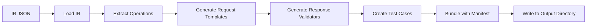

# Test Scenario Builder

> Generate executable test scenarios from OpenAPI intermediate representation

## Overview

The Test Scenario Builder transforms normalized OpenAPI specifications (IR JSON) into structured test scenario bundles. Each test case includes request templates, expected responses, and validation rules, ready for execution by the test executor.

## Features

- ✅ **Automatic Test Generation**: Creates test cases for each API operation
- ✅ **Request Templates**: Pre-filled with example values from OpenAPI spec
- ✅ **Response Validation**: Expected status codes and response schemas
- ✅ **Scenario Bundling**: Organized test suites per service/version
- ✅ **Extensible**: Easy to customize test generation logic

## Installation

```bash
# Install all dependencies
uv sync

# Install development dependencies
uv sync --group dev
```

## Usage

### Basic Usage

```bash
# Generate test scenarios from IR
uv run python apps/test-scenario-builder/test_scenario_builder/main.py \
    --ir workspace/catalog/payments-api/1.0.0.json \
    --output-dir artifacts/tests
```

### With Custom Prefix

```bash
# Add custom prefix to scenario names
uv run python apps/test-scenario-builder/test_scenario_builder/main.py \
    --ir workspace/catalog/payments-api/1.0.0.json \
    --output-dir artifacts/tests \
    --scenario-prefix smoke
```

### Command-Line Options

| Option | Required | Default | Description |
|--------|----------|---------|-------------|
| `--ir` | Yes | - | Path to IR JSON file from contract parser |
| `--output-dir` | Yes | - | Output directory for test scenarios |
| `--scenario-prefix` | No | `test` | Prefix for scenario names |
| `--log-level` | No | `INFO` | Logging level (DEBUG, INFO, WARNING, ERROR) |

### Environment Variables

```bash
# Control output format
$env:CONSOLE_OUTPUT_FORMAT = "rich"  # rich, plain, json, auto

# Set logging level
$env:LOG_LEVEL = "DEBUG"
```

## Output Structure

### Directory Layout

```
artifacts/tests/
  payments-api/
    1.0.0/
      manifest.json              # Test suite metadata
      test_create_payment.json   # Individual test cases
      test_get_payment.json
      test_list_payments.json
```

### Manifest Format

```json
{
  "service": "payments-api",
  "version": "1.0.0",
  "scenario_prefix": "smoke",
  "tests": [
    {
      "test_id": "test_create_payment",
      "operation_id": "createPayment",
      "method": "POST",
      "path": "/payments",
      "file": "test_create_payment.json"
    }
  ],
  "metadata": {
    "generated_at": "2026-01-12T12:29:06.123456Z",
    "total_tests": 3
  }
}
```

### Test Case Format

```json
{
  "test_id": "test_create_payment",
  "operation_id": "createPayment",
  "description": "Create a new payment",
  "request": {
    "method": "POST",
    "path": "/payments",
    "headers": {
      "Content-Type": "application/json"
    },
    "body": {
      "amount": 100.50,
      "currency": "USD",
      "paymentMethod": "card"
    }
  },
  "expected_response": {
    "status_code": 200,
    "schema": {
      "type": "object",
      "properties": {
        "paymentId": {"type": "string"},
        "status": {"type": "string"}
      },
      "required": ["paymentId", "status"]
    }
  },
  "validation": {
    "validate_schema": true,
    "validate_status": true,
    "custom_rules": []
  }
}
```

## Architecture

### Core Components

```
test_scenario_builder/
  __init__.py
  main.py              # CLI entry point
  generator.py         # Test generation logic
  models.py            # Pydantic data models
  templates.py         # Request/response templates
```

### Data Flow



### Test Generation Process

1. **Load IR**: Parse intermediate representation JSON
2. **Extract Operations**: Identify all API operations
3. **Generate Templates**: Create request templates with example values
4. **Define Validation**: Set up response validation rules
5. **Create Bundles**: Organize tests by service/version
6. **Write Output**: Save manifest and test case files

## Implementation Details

### Request Template Generation

Request templates are generated from OpenAPI specifications:

```python
def generate_request_template(operation):
    """Generate request template from operation"""
    template = {
        "method": operation["method"],
        "path": operation["path"],
        "headers": generate_headers(operation),
    }
    
    # Add body for POST/PUT/PATCH
    if operation["method"] in ["POST", "PUT", "PATCH"]:
        template["body"] = generate_body_from_schema(
            operation["requestBody"]["schema"]
        )
    
    # Add query parameters
    if operation.get("parameters"):
        template["query"] = generate_query_params(
            operation["parameters"]
        )
    
    return template
```

### Response Validation

Validation rules are derived from OpenAPI response definitions:

```python
def generate_validation_rules(operation):
    """Generate validation rules from operation"""
    return {
        "validate_schema": True,
        "validate_status": True,
        "expected_status": operation["responses"]["default"]["status"],
        "schema": operation["responses"]["default"]["schema"],
        "custom_rules": extract_custom_rules(operation)
    }
```

### Example Value Generation

Example values are generated based on schema types:

| Schema Type | Example Value |
|-------------|---------------|
| `string` | `"example-string"` |
| `integer` | `42` |
| `number` | `123.45` |
| `boolean` | `true` |
| `array` | `[example_item]` |
| `object` | `{key: example_value}` |

With special handling for:
- **Formats**: `email`, `uuid`, `date-time`, etc.
- **Patterns**: Regex-based string generation
- **Enums**: Random selection from enum values
- **Examples**: Use OpenAPI `example` field if provided

## Examples

### Generate Tests for Payments API

```bash
# Parse contract first
uv run python apps/contract-parser/contract_parser/main.py \
    --spec specs/payments.yaml \
    --output-dir workspace/catalog

# Generate test scenarios
uv run python apps/test-scenario-builder/test_scenario_builder/main.py \
    --ir workspace/catalog/payments-api/1.0.0.json \
    --output-dir artifacts/tests \
    --scenario-prefix smoke
```

**Output:**
```
✓ Loaded IR for payments-api v1.0.0
✓ Found 5 operations
✓ Generated 5 test cases
✓ Created test bundle at artifacts/tests/payments-api/1.0.0/
```

### Generate Tests for Multiple Services

```powershell
# PowerShell script to generate tests for all services
$specs = @("payments.yaml", "commerce.yaml", "flights.yaml")

foreach ($spec in $specs) {
    Write-Host "Processing $spec..." -ForegroundColor Cyan
    
    # Parse
    uv run python apps/contract-parser/contract_parser/main.py `
        --spec "specs/$spec" `
        --output-dir workspace/catalog
    
    # Generate tests
    $irFiles = Get-ChildItem -Path workspace/catalog -Recurse -Filter "*.json" | 
               Where-Object { $_.Name -ne "index.json" }
    
    foreach ($ir in $irFiles) {
        uv run python apps/test-scenario-builder/test_scenario_builder/main.py `
            --ir $ir.FullName `
            --output-dir artifacts/tests `
            --scenario-prefix smoke
    }
}
```

### Custom Test Generation

```python
# custom_generator.py
from test_scenario_builder.generator import TestGenerator
from test_scenario_builder.models import IROperation

class CustomTestGenerator(TestGenerator):
    """Custom test generator with enhanced logic"""
    
    def generate_test_case(self, operation: IROperation):
        """Override to add custom test generation logic"""
        test_case = super().generate_test_case(operation)
        
        # Add custom authentication headers
        test_case["request"]["headers"]["Authorization"] = "Bearer ${AUTH_TOKEN}"
        
        # Add custom validation rules
        test_case["validation"]["custom_rules"].append({
            "rule": "response_time_under_1s",
            "max_duration": 1.0
        })
        
        return test_case

# Usage
generator = CustomTestGenerator(ir_path="workspace/catalog/payments-api/1.0.0.json")
generator.generate_all(output_dir="artifacts/tests")
```

## Integration with Pipeline

### Universal Pipeline

The test-scenario-builder is automatically executed by the universal pipeline:

```powershell
# Automatic execution as part of pipeline
.\scripts\run-smoke-pipeline.ps1 -SpecPath "specs/payments.yaml"
```

Pipeline steps:
1. Parse contract → IR JSON
2. Generate mock config
3. **Generate test scenarios** ← This component
4. Start mock server
5. Execute tests

### Manual Integration

```bash
# Step 1: Parse contract
uv run python apps/contract-parser/contract_parser/main.py \
    --spec specs/payments.yaml \
    --output-dir workspace/catalog

# Step 2: Generate tests (this component)
uv run python apps/test-scenario-builder/test_scenario_builder/main.py \
    --ir workspace/catalog/payments-api/1.0.0.json \
    --output-dir artifacts/tests

# Step 3: Execute tests
uv run python apps/test-executor/test_executor/main.py \
    --bundle artifacts/tests/payments-api/1.0.0 \
    --output-dir runs
```

## Configuration

### Scenario Customization

Create a configuration file for custom scenario generation:

```yaml
# scenario-config.yaml
scenario:
  prefix: smoke
  timeout: 30
  retry: 3

test_generation:
  include_auth: true
  validate_schema: true
  validate_status: true
  generate_negative_tests: false

templates:
  string_format:
    email: "test@example.com"
    uuid: "00000000-0000-0000-0000-000000000000"
    date-time: "2026-01-12T12:00:00Z"
  
  default_headers:
    Content-Type: "application/json"
    Accept: "application/json"
```

Usage:
```bash
uv run python apps/test-scenario-builder/test_scenario_builder/main.py \
    --ir workspace/catalog/payments-api/1.0.0.json \
    --output-dir artifacts/tests \
    --config scenario-config.yaml
```

## Troubleshooting

### Issue: Missing Request Body

**Problem:** Test cases have empty request bodies

**Solution:** Ensure OpenAPI spec has `requestBody` definitions with schemas:

```yaml
requestBody:
  required: true
  content:
    application/json:
      schema:
        type: object
        properties:
          amount:
            type: number
            example: 100.50
```

### Issue: Invalid Example Values

**Problem:** Generated example values don't match schema constraints

**Solution:** Add explicit `example` fields in OpenAPI spec:

```yaml
properties:
  email:
    type: string
    format: email
    example: "user@example.com"  # Use this example
```

### Issue: No Tests Generated

**Problem:** Test bundle is empty

**Solution:** Check IR JSON has operations:

```bash
# Verify IR structure
cat workspace/catalog/payments-api/1.0.0.json | jq '.operations'

# Check contract parser output
uv run python apps/contract-parser/contract_parser/main.py \
    --spec specs/payments.yaml \
    --output-dir workspace/catalog \
    --log-level DEBUG
```

## Development

### Running Tests

```bash
# Run unit tests
uv run pytest apps/test-scenario-builder/tests/

# With coverage
uv run pytest --cov=test_scenario_builder apps/test-scenario-builder/tests/
```

### Code Quality

```bash
# Format code
ruff format apps/test-scenario-builder/

# Lint code
ruff check apps/test-scenario-builder/

# Fix issues
ruff check --fix apps/test-scenario-builder/
```

### Adding New Features

1. **Create feature branch**: `git checkout -b feature/my-feature`
2. **Implement feature**: Add code to appropriate module
3. **Add tests**: Create tests in `tests/` directory
4. **Update documentation**: Update this README
5. **Run quality checks**: `ruff format && ruff check`
6. **Submit PR**: Create pull request with description

## Dependencies

- **Python 3.12+**: Modern Python features and performance
- **Typer 0.15.0+**: CLI framework with rich help
- **Pydantic 2.10.0+**: Data validation and serialization
- **PyYAML 6.0.2+**: YAML processing
- **structlog 24.4.0+**: Structured logging
- **Rich 13.9.0+**: Beautiful terminal output

## Related Components

- [Contract Parser](../contract-parser/README.md) - Generates IR JSON input
- [Test Executor](../test-executor/README.md) - Executes generated test scenarios
- [Mock Config Builder](../mock-config-builder/README.md) - Generates mock configurations
- [Pipeline Scripts](../../scripts/README.md) - Universal pipeline automation

## License

Part of the API Smoke Test Platform project.
