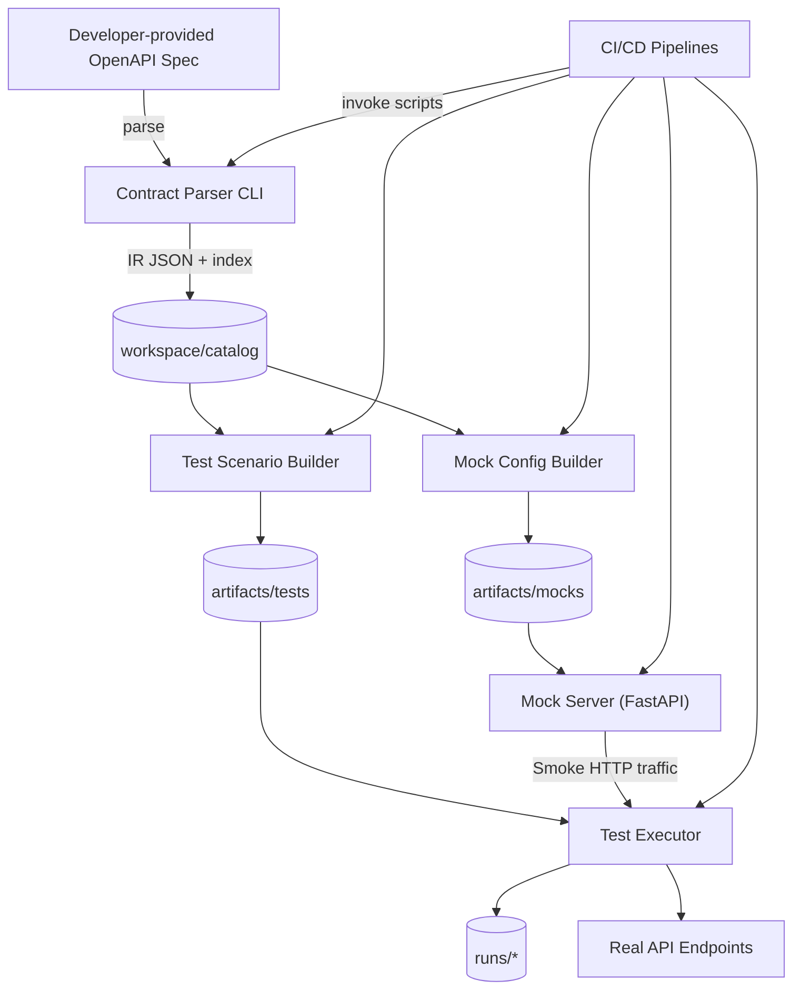
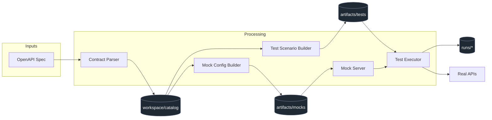
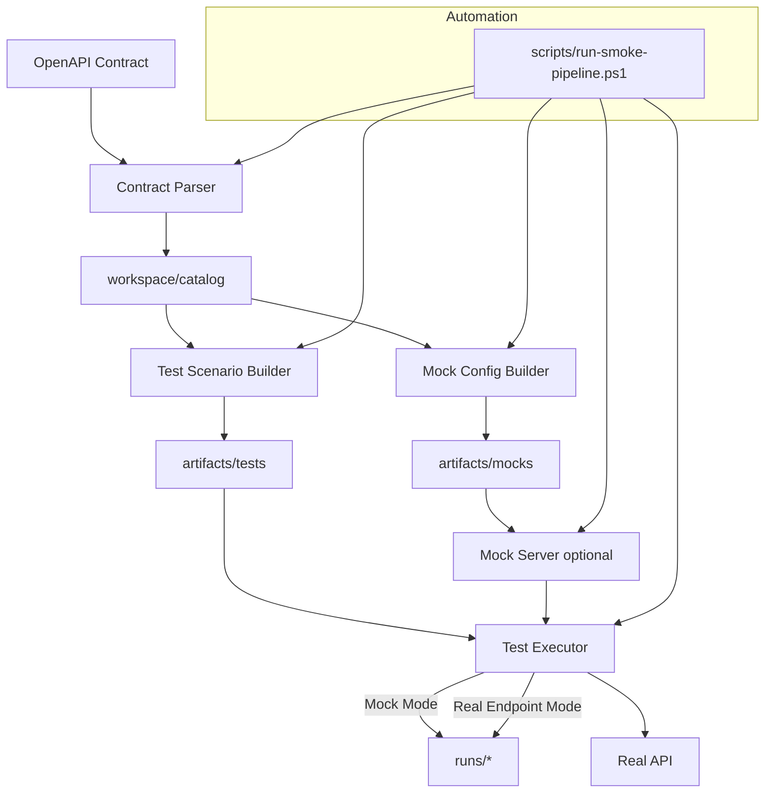

# API Smoke Test Platform – Architectural Overview

Contract-driven automation suite that turns OpenAPI specifications into executable smoke tests and mock servers using a modern Python 3.12+ toolchain managed by Hatch and uv.

---

## 1. Executive Summary & System Context

The platform converts OpenAPI contracts into infrastructure-free smoke coverage in minutes. It emphasizes three pillars documented in [`README.md`](README.md):

- **Zero-config pipeline:** `scripts/run-smoke-pipeline.ps1` inspects any spec in `specs/` and orchestrates parsing, mock generation, scenario building, mock runtime startup, and smoke execution with sensible defaults (ports, output dirs, console format).
- **Modern tooling:** Python 3.12+, uv for dependency resolution, Hatch for task automation, Ruff for formatting/linting, mypy for type checking, and pytest for unit coverage (see [`pyproject.toml`](pyproject.toml)).
- **Rich observability:** Structured logging via `structlog`, multiple console renderers (auto/rich/plain/json), timestamped `runs/` artifacts, and deterministic mock payloads.

**Personas and entry points**

- API producers/QA use the universal PowerShell script for end-to-end runs.
- Scenario engineers invoke individual CLIs (parser, scenario builder, mock builder, executor) when tweaking specific stages.
- CI/CD systems reuse the same scripts or direct Typer commands with `CONSOLE_OUTPUT_FORMAT=plain`.

**Primary artifact locations**

| Artifact | Description | Location |
|----------|-------------|----------|
| Contract IR | Normalized JSON snapshots + keyword index | `workspace/catalog/{service}/{version}.json`, `workspace/catalog/index.json` |
| Mock configs | FastAPI-ready YAML per service/version | `artifacts/mocks/{service}/{version}/mock-config.yaml` |
| Test bundles | Scenario manifests + payloads/drivers | `artifacts/tests/{service}/{version}/` |
| Test results | Scenario, results, logs per run | `runs/{scenario}-{timestamp}/` |

---

## 2. Architecture Overview (C4 System Context)

This view shows how OpenAPI specs flow through CLI applications residing under `apps/` and how CI/CD actors or engineers trigger them. All components share consistent logging/output behavior thanks to common utility modules (e.g., `test_executor/output_config.py`).

---

## 3. Core Components

### 3.1 Contract Parser

Source: [`apps/contract-parser/`](apps/contract-parser/README.md)

| Aspect | Details |
|--------|---------|
| Inputs | OpenAPI 3.0+ specs from `specs/*.yaml` (single or multiple `--spec` arguments) |
| Outputs | Normalized IR JSON (`workspace/catalog/{service}/{version}.json`) and keyword index (`workspace/catalog/index.json`) |
| Key behaviors | Validates schema, normalizes operations, auto-detects service/version, replaces FAISS with JSON keyword search |
| CLI | `uv run python apps/contract-parser/contract_parser/main.py --spec specs/payments.yaml --output-dir workspace/catalog` |

Design notes:
- Uses Pydantic models (`contract_parser/models.py`) to enforce IR structure.
- Keyword extraction logic (see [`apps/contract-parser/contract_parser/indexer.py`](apps/contract-parser/contract_parser/indexer.py)) makes IR searchable without binary deps.
- Hatch shortcuts defined in [`pyproject.toml`](pyproject.toml) allow `hatch run parse --spec ...`.

### 3.2 Mock Config Builder

Source: [`apps/mock-config-builder/`](apps/mock-config-builder/README.md)

| Aspect | Details |
|--------|---------|
| Inputs | IR JSON from catalog |
| Outputs | YAML mock configuration per service/version (`artifacts/mocks/.../mock-config.yaml`) |
| Key behaviors | Generates deterministic response templates, ports/host configuration, optional custom overrides |
| CLI | `uv run python apps/mock-config-builder/mock_config_builder/main.py --ir workspace/catalog/payments-api/1.0.0.json --output-dir artifacts/mocks --port rest=9101` |

Highlights:
- Response templates derive from schema examples with fallbacks (see [`apps/mock-config-builder/mock_config_builder/generator.py`](apps/mock-config-builder/mock_config_builder/generator.py)).
- Supports advanced YAML for latency simulation, CORS, authentication.
- Outputs align with mock server expectations (routes, headers, bodies).

### 3.3 Test Scenario Builder

Source: [`apps/test-scenario-builder/`](apps/test-scenario-builder/README.md)

| Aspect | Details |
|--------|---------|
| Inputs | Same IR JSON used by mock builder |
| Outputs | Scenario bundles containing `manifest.json`, test files, payloads |
| Key behaviors | Auto-generates request templates, validation rules, schema-driven payloads, scenario prefixes |
| CLI | `uv run python apps/test-scenario-builder/test_scenario_builder/main.py --ir ... --output-dir artifacts/tests --scenario-prefix smoke` |

Notes:
- Builder organizes tests per operation and prepares metadata consumed by executor drivers (see [`apps/test-scenario-builder/test_scenario_builder/builder.py`](apps/test-scenario-builder/test_scenario_builder/builder.py)).
- Supports custom config files for templates and authentication flags.

### 3.4 Mock Server

Source: [`apps/mock-server/`](apps/mock-server/README.md)

| Aspect | Details |
|--------|---------|
| Inputs | Generated `mock-config.yaml` |
| Outputs | FastAPI runtime serving deterministic responses |
| Key behaviors | Structured logging (rich/plain/json), route registration based on config, environment-driven output formats |
| CLI | `uv run python apps/mock-server/mock_server/main.py --config artifacts/mocks/payments-api/1-0-0/mock-config.yaml` |

Design features:
- Logging utilities in [`apps/mock-server/mock_server/logging_utils.py`](apps/mock-server/mock_server/logging_utils.py) respect `CONSOLE_OUTPUT_FORMAT`.
- Shares `output_config.py` conventions with test executor to keep CLI/ENV priority consistent.
- Supports background job execution for parallel mock instances.

### 3.5 Test Executor

Source: [`apps/test-executor/`](apps/test-executor/README.md)

| Aspect | Details |
|--------|---------|
| Inputs | Scenario bundle path, optional overrides (output dir, output format, base URL) |
| Outputs | Rich/plain/json console summaries plus `runs/{scenario}/results.json` |
| Key behaviors | Smart environment detection (TTY + CI env vars), progress bars (`rich`), structured JSON outputs, driver-based HTTP execution |
| CLI | `uv run python apps/test-executor/test_executor/main.py --bundle artifacts/tests/payments-api/1.0.0 --output-dir runs` |

Implementation notes:
- `ConsoleReporter` ([`apps/test-executor/test_executor/console_reporter.py`](apps/test-executor/test_executor/console_reporter.py)) handles rendering decisions.
- `runner.py` orchestrates HTTP calls via per-operation definitions in scenario files.
- Common env vars: `SMOKE_RUNTIME_BASE_URL`, `SMOKE_RUNTIME_TIMEOUT`, `CONSOLE_OUTPUT_FORMAT`.

---

## 4. Component Relationships (Mermaid Component Diagram)

This component view highlights persistent storage directories and shows that both mock and real endpoints are first-class targets for the same test bundles.

---

## 5. Tooling & Configuration Stack

**Dependency management and scripts**

- Managed via uv (`uv sync`, `uv run ...`) and Hatch (see `[tool.hatch.envs.default]` in [`pyproject.toml`](pyproject.toml)).
- Hatch scripts (`parse`, `build_mock`, `build_scenario`, `serve_mock`, `execute`, `lint`, `format`, `type_check`, `tests`) wrap common commands.

**Code quality**

| Task | Command | Configuration |
|------|---------|---------------|
| Formatting | `uv run ruff format apps/` | [`tool.ruff`](pyproject.toml) with 100-char lines |
| Linting | `uv run ruff check apps/` | Enforces E/F/I/N/W/UP rules |
| Type checking | `uv run mypy apps/...` | Strict mode with `warn_return_any`, `disallow_untyped_defs` |
| Tests | `uv run pytest` | Targets `apps/` and (future) `libs/` per [`tool.pytest.ini_options`](pyproject.toml) |

**Environment variables**

| Variable | Scope | Effect |
|----------|-------|--------|
| `CONSOLE_OUTPUT_FORMAT` | All CLIs | `auto` (smart), `rich`, `plain`, `json` |
| `SMOKE_RUNTIME_BASE_URL` | Test Executor | Overrides default `http://127.0.0.1:9101` when targeting real APIs |
| `SMOKE_RUNTIME_TIMEOUT` | Test Executor | Request timeout (seconds) |
| `LOG_LEVEL` or `SMOKE_RUNTIME_LOG_LEVEL` | All | Logging verbosity |

---

## 6. Workflow Deep-Dive

- Manual users can execute each Typer CLI independently (see step-by-step commands in [`README.md`](README.md) and [`plans/api-first-rest-mock-workflow-example.md`](plans/api-first-rest-mock-workflow-example.md)).
- The pipeline script automates parallel runs by varying `-SpecPath`, `-RestPort`, and `-OutputFormat`.

---

## 7. Execution Modes

| Mode | When to use | Key commands |
|------|-------------|--------------|
| **Automated pipeline** | Full contract-to-smoke flow with zero manual interventions | `pwsh scripts/run-smoke-pipeline.ps1 -SpecPath specs/payments.yaml -OutputFormat rich` |
| **Manual CLI chain** | Debugging specific stages or customizing outputs | Sequence of `uv run python apps/.../main.py` commands (parser → mock config → scenario → mock server → executor) |
| **CI/CD** | GitHub/GitLab Jenkins pipelines | Use `CONSOLE_OUTPUT_FORMAT=plain` and upload `runs/` artifacts (examples in [`README.md`](README.md), `.github/workflows/smoke-tests.yml`, `.gitlab-ci.yml`) |

The same scenario bundle can target either the local mock server or production-like endpoints by changing `SMOKE_RUNTIME_BASE_URL`.

---

## 8. Data & Observability

- **Structured logging:** `structlog` renderers configured via [`mock_server/logging_utils.py`](apps/mock-server/mock_server/logging_utils.py) and shared `output_config` modules ensure consistent console/plain/json outputs.
- **Run artifacts:** Each execution writes `scenario.json`, `results.json`, and optionally `summary.txt`/`events.jsonl` under `runs/{scenario}-{timestamp}/` for traceability.
- **Mock runtime telemetry:** Logs entries such as `request_received` and `request_served` with latency metrics, enabling quick validation of contract behavior.
- **Test executor reporting:** Rich tables (interactive), plain text (CI), or JSON (automation) summarizing pass/fail counts, durations, endpoints.

---

## 9. Appendix & References

- Detailed architecture deep dive: [`plans/api-smoke-architecture.md`](plans/api-smoke-architecture.md)
- Manual mock workflow example: [`plans/api-first-rest-mock-workflow-example.md`](plans/api-first-rest-mock-workflow-example.md)
- Smoke runtime environment specifics: [`plans/smoke-runtime-environment.md`](plans/smoke-runtime-environment.md)
- Component READMEs: contract parser, mock config builder, test scenario builder, mock server, test executor (see links above)
- Scripts: [`scripts/run-smoke-pipeline.ps1`](scripts/run-smoke-pipeline.ps1), [`scripts/payments-smoke-e2e.ps1`](scripts/payments-smoke-e2e.ps1)

> This document stays in sync with [`README.md`](README.md) and component docs; update both when introducing new tooling, artifact paths, or workflows.
